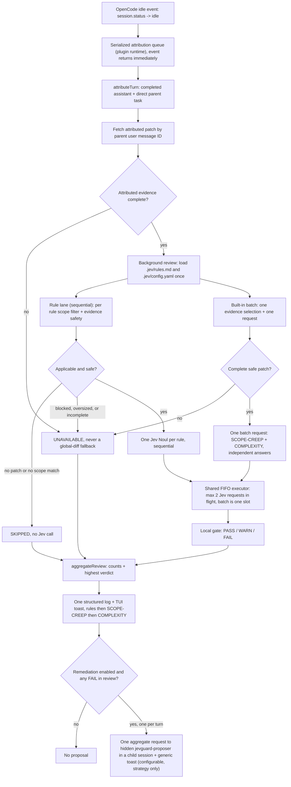

# Contributing to JevGuard

Thanks for contributing. JevGuard is designed to make coding-agent changes more
trustworthy without pretending that incomplete evidence is safe to judge.

## Before you start

Read:

- [`README.md`](./README.md) for product intent;
- local [`SPEC.md`](./SPEC.md) for scope and the normative contracts;
- [`AGENTS.md`](./AGENTS.md) for architecture and code standards;
- local [`docs/adr`](./docs/adr) for decisions that should not be casually reversed.

`SPEC.md`, `CONTEXT.md`, `docs/adr/`, and `docs/tasks/` are intentionally local
planning records and are ignored by Git. Do not add, force-add, or publish them.

## Development setup

The project uses pnpm workspaces. Bun is the OpenCode plugin runtime, not the
workspace package manager.

```sh
corepack enable
pnpm install
```

Run the workspace checks before opening a pull request:

```sh
pnpm format
pnpm lint
pnpm typecheck
pnpm test
```

`pnpm check` runs the same sequence in one command. The CLI (`jevguard login`) and
the OpenCode plugin run under the Bun runtime; Bun is not the workspace package
manager.

## Architecture and debugging guide

This is a working map for locating and fixing behavior. `SPEC.md`, `CONTEXT.md`,
and `docs/adr/` remain authoritative for scope and contracts.

### Package dependency direction

```text
plugin → opencode-adapter → core
testkit ───────────────────┘
```

- `core` is pure domain logic: rules, scope, evidence policy, gates, Jev ports,
  and use cases. It must not import OpenCode, Bun, Node filesystem/environment, HTTP,
  or TUI APIs.
- `opencode-adapter` owns host integration and I/O: event handling, turn
  attribution, policy file reads, concrete Jev transport, credentials, logging,
  toasts, and the proposal child session.
- `plugin` is composition only: it constructs dependencies and exposes the OpenCode
  entrypoint. No policy logic belongs here.
- `testkit` provides fixtures and fakes; production packages must never import it.

When a bug crosses a boundary, fix it in the layer that owns that concern. A
presentation symptom with an attribution cause belongs in `opencode-adapter`, not
in `plugin` or `core`.

### End-to-end runtime flow

1. OpenCode emits a session idle event. `idleSessionID` accepts only
   `session.status` with `properties.status.type === "idle"`; the separate
   `session.idle` event is ignored.
2. `createPluginRuntime` returns the event hook immediately after scheduling: idle
   work is serialized through a promise queue so attribution and the dedupe mark never
   overlap, while the attributed review runs detached from the host event.
3. `attributeTurn` finds the completed assistant message, its direct parent user
   message, and the patch attributed to that parent message ID. Failures are never
   marked, so the turn can be retried.
4. `reviewAttributedTurn` loads `.jev/rules.md` and `.jev/config.yaml` once, parses
   every rule block, and resolves the gate config once.
5. The local rule lane and the built-in batch run concurrently. Rules stay sequential
   in source order inside their lane; the batch selects the turn's complete, safe,
   attributed patch once and sends both built-ins as one request with two independent
   named answers. `SCOPE-CREEP` uses fixed `0.65`/`0.90` error thresholds; `COMPLEXITY`
   uses a fixed `0.50` advisory threshold and never fails. One malformed answer fails
   only its own check.
6. The concrete transport is wrapped by one shared FIFO concurrency limit
   (`createFifoJevPort`, default `2`) created in the composition root, so at most two
   Jev requests are in flight across the rule lane and the built-in batch of a plugin
   instance. The batch counts as one request.
7. `evaluateRules` evaluates each parsed rule in source order. One rule's failure
   never suppresses its siblings, and one built-in answer never suppresses the other.
8. `evaluateRule` selects the rule's scoped, safe, complete evidence, then calls the
   Jev port at most once with one Noul request. Missing scope or patch is `SKIPPED`
   without calling Jev.
9. `evaluateGate` converts the returned violation probability into a local
   `PASS`/`WARN`/`FAIL` using exact thresholds; `SCOPE-CREEP` and `COMPLEXITY` use
   their fixed gates.
10. `aggregateReview` counts every outcome and picks the highest verdict;
    `reviewAttributedTurn` presents exactly one aggregate to the structured log and
    the TUI toast. Results are the rules in source order, then `SCOPE-CREEP`, then
    `COMPLEXITY`, regardless of completion timing.
11. After presentation, when remediation is enabled and the review contains any
    `FAIL`, `buildProposalRequest` builds one aggregate request — every `FAIL` finding
    (local `error` rules and the `SCOPE-CREEP` built-in), the task, and the complete,
    safe, full attributed patch — and `proposeForTurn` sends it once to the hidden
    `jevguard-proposer` subagent in an isolated child session parented to the source
    session. The full patch must pass the safety policy; a blocked or oversized patch
    records no proposal. The child session is excluded from review, and a host, model,
    or toast failure never affects the review or later turns.



### Safe auto-propose remediation

Remediation is not part of the review lane and needs no separate entrypoint. It is
automatic, configurable, and strategy-only. After presentation, when `.jev/config.yaml`
enables remediation and the review contains any `FAIL`, the review builds one
aggregate request — every `FAIL` finding (local `error` rules and the `SCOPE-CREEP`
built-in), the task, and the complete, safe, full attributed patch — and schedules at
most one proposal. The plugin `config` hook registers the hidden `jevguard-proposer`
subagent with wildcard-disabled tools and wildcard-deny permissions
(`{"*": "deny"}`); there is no command hook.

`proposeForTurn` claims the evaluated turn (`messageID`), creates one child session
parented to the source session, registers it so its own idle events are excluded from
review for the plugin lifetime, and prompts the proposer subagent with the configured
model and a fixed system prompt. The subagent cannot call a tool, edit a file, or
produce a patch: it returns a strategy and one manual apply instruction. A generic
toast reports that the proposal is ready. Every host, model, or toast failure is
contained and never affects the review or later turns.

The full attributed patch must pass the same safety policy as the review. A blocked or
oversized patch records no proposal, even when a rule-scoped `FAIL` exists, and there
is never a repository or global diff fallback. At most one proposal is created per
evaluated turn, and there is no retry, loop, or re-evaluation. The user copies the
proposal's manual apply instruction into their normal coding agent; that apply is an
ordinary completed assistant turn, so the review lane verifies it through the normal
server idle evaluation — there is no separate verifier and no automatic apply.

### Key files by bug category

- Attribution
  - `packages/plugin/src/idle-event.ts` — host event filter.
  - `packages/plugin/src/runtime.ts` — serialized attribution queue, detached reviews, drain handle.
  - `packages/opencode-adapter/src/attribution/attribute-turn.ts` — turn orchestration.
  - `.../attribution/locate-turn.ts` — completed assistant and direct parent selection.
  - `.../attribution/task.ts` — user task extraction.
  - `.../attribution/normalize-patch.ts` — patch completeness.
  - `.../attribution/deduplicator.ts` — per-assistant-message dedupe.
- Parser and policy
  - `packages/core/src/rules/` — rule parsing, blocks, headings, metadata.
  - `packages/opencode-adapter/src/policy/file-source.ts` — fixed `.jev/` paths.
  - `packages/opencode-adapter/src/policy/config-yaml.ts` — strict YAML parsing.
- Evidence and gate
  - `packages/core/src/evidence/select-evidence.ts` — scope, size, and assembly.
  - `.../evidence/safety.ts` — sensitive path and extension policy.
  - `.../evidence/scope.ts`, `.../evidence/paths.ts` — matching helpers.
  - `packages/core/src/gate/evaluate-gate.ts` — threshold boundaries.
  - `.../gate/config.ts`, `.../gate/probability.ts` — config validation.
- Built-in checks
  - `packages/core/src/builtins/evaluate-builtins.ts` — one evidence selection, one
    batch request, and the fixed gates for both checks.
  - `packages/core/src/builtins/scope-creep.ts` — `SCOPE-CREEP` question and fixed
    `0.65`/`0.90` error gate.
  - `packages/core/src/builtins/complexity.ts` — `COMPLEXITY` question and fixed
    `0.50` advisory gate that never fails.
  - `packages/core/src/concurrency/fifo-port.ts` — shared FIFO Jev concurrency limit.
  - `packages/plugin/src/review.ts` — runs the rule lane and the built-in batch concurrently.
- Jev and credential
  - `packages/opencode-adapter/src/jev/transport.ts` — TypeSafe transport and response reading.
  - `packages/core/src/ports/types.ts` — the Jev port contract.
  - `packages/opencode-adapter/src/credentials/provider.ts` — override/store precedence.
  - `.../credentials/environment.ts`, `.../credentials/keyring-store.ts` — stores.
  - `packages/plugin/src/cli/` — `jevguard login` dispatch and messages.
- Presentation
  - `packages/plugin/src/present.ts` — non-throwing delivery.
  - `packages/plugin/src/review-result.ts` — synthetic pre-evaluation `UNAVAILABLE`.
  - `packages/opencode-adapter/src/presentation/opencode.ts` — SDK log/toast sinks.
  - `.../presentation/display.ts`, `.../presentation/log.ts`, `.../presentation/toast.ts`
    — outcome precedence and safe aggregate messages.
- Remediation
  - `packages/core/src/remediation/config.ts` — strict `remediation` config validation
    and the `provider/model` specifier split.
  - `packages/core/src/remediation/request.ts` — one aggregate proposal request from
    every `FAIL` finding and the complete, safe, full attributed patch.
  - `packages/core/src/remediation/store.ts` — one-proposal claim and child-session
    exclusion.
  - `packages/core/src/remediation/prompt.ts` — fixed proposer system prompt and
    labelled untrusted-data user content.
  - `packages/opencode-adapter/src/presentation/remediation.ts` — the fixed, generic
    remediation-ready toast.
  - `packages/opencode-adapter/src/remediation/opencode.ts` — child-session creation
    and proposer prompt over the OpenCode SDK.
  - `packages/plugin/src/remediation/config.ts` — registers the hidden
    `jevguard-proposer` subagent on the host config.
  - `packages/plugin/src/remediation/propose.ts` — claims, creates the child session,
    prompts the proposer, and notifies.
- Composition and artifact
  - `packages/plugin/src/plugin.ts` — composition root.
  - `packages/plugin/src/review.ts` — policy load + evaluate + present.
  - `packages/plugin/scripts/build-artifact.ts`, `pack-artifact.ts` — packaging.

### Non-negotiable invariants

- Use attributed evidence only. Never substitute the current repository diff when
  attribution fails.
- Never emit a semantic verdict from partial evidence. Oversized, missing, blocked,
  invalid, or incomplete evidence is `UNAVAILABLE`.
- One applicable rule maps to exactly one Jev Noul. `Allowed` stays inside that
  Noul's criteria; never add a second decision.
- No patch or no scope match is `SKIPPED` without calling Jev.
- Keep the review background and observe-only: never inject agent context, prompt the
  source session, block a turn, or edit code from the review. Safe auto-propose
  remediation is a separate, configurable workflow (`SPEC.md` §8) delivered by the
  server plugin; it acts only when a review contains a `FAIL` and the complete full-turn
  evidence is safe. Never widen it to unattended retries, re-evaluation, automatic
  apply, or code edits, and never let the proposer prompt the source session or inject
  into its context.
- Never expose the API key in config, arguments, logs, errors, toasts, fixtures, or
  agent context. Accept the key only through the OS credential store or the
  CI/automation environment override.

### Built-in checks

V0.1 evaluates the rule blocks declared in `.jev/rules.md` plus two built-in checks,
`SCOPE-CREEP` and `COMPLEXITY`. Both run as one batch request with two independent
named answers alongside the sequential rule lane over the turn's complete, safe
attributed patch. One malformed answer fails only its own check. `SCOPE-CREEP` uses
fixed `0.65`/`0.90` error thresholds; `COMPLEXITY` uses a fixed `0.50` advisory
threshold and never fails. Neither reads the configured rule gate. The concrete
transport is wrapped by one shared FIFO concurrency limit (`createFifoJevPort`,
default `2`) so at most two Jev requests are in flight, counting the batch as one
request. Test adequacy remains a planned built-in, not implemented; do not describe or
test it as existing behavior.

### Focused validation

Run the full workspace checks before a pull request:

```sh
pnpm format
pnpm lint
pnpm typecheck
pnpm test
```

During debugging, run the narrowest Vitest target for the area you changed, for
example:

```sh
pnpm test packages/core/src/evidence
pnpm test packages/opencode-adapter/src/attribution
pnpm test packages/plugin
```

Cover threshold boundaries exactly and add a regression test for every corrected
defect. Contract-test attribution and presentation behavior in the adapter with
fakes from `testkit`; unit-test pure parsing, scope, evidence safety, gates, and
orchestration in `core`.

## Contribution expectations

- Keep changes focused and preserve package dependency direction.
- Add or update tests for behavior changes and regressions.
- Do not use a global git diff as fallback evidence.
- Do not change `UNAVAILABLE` into a semantic verdict.
- Keep the review observe-only. Do not add blocking behavior, source-session
  prompting, or agent-context injection to the review. The auto-propose remediation
  workflow must stay configurable, bounded, strategy-only, and separate.
- Do not expose API keys, environment files, secrets, or rejected evidence in
  tests, fixtures, logs, or documentation.
- Do not accept the TypeSafe API key as a CLI argument or repository setting. Local
  credentials use `jevguard login` and the OS credential store; the environment
  override is reserved for CI and controlled automation.

## Pull requests

Explain the problem, behavioral change, tests, and documentation updates. Mention
any intentional deviation from `SPEC.md` or an ADR.

Keep pull requests reviewable. If a change introduces a hard-to-reverse boundary,
technology commitment, or non-obvious trade-off, propose an ADR with it.

## Code style

Write small, readable TypeScript modules. Prefer strong types, explicit names, and
whitespace between logical steps over comments. TSDoc is for public contracts and
non-obvious invariants, not for narrating implementation. Centralize a feature's
interfaces, unions, and shared type aliases in a focused `types.ts` module; keep a
type beside implementation only when it is truly private and extraction would make
the module less readable.

## License

By contributing, you agree that your contributions are licensed under the
[MIT License](./LICENSE).
