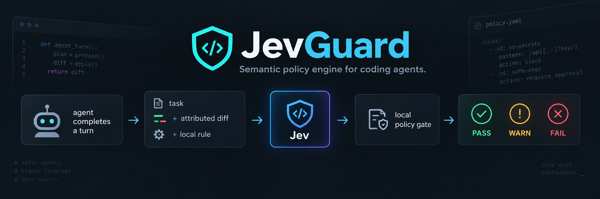

# JevGuard

> **Semantic policy engine for coding agents.**



JevGuard checks the code an agent just changed against the policies that matter in
your repository. It uses Jev for a narrow semantic judgment, then applies your
local deterministic gate to return `PASS`, `WARN`, or `FAIL`.

```text
agent completes a turn
        ↓
task + attributed diff + local rule
        ↓
       Jev
        ↓
local policy gate
        ↓
  PASS · WARN · FAIL
```

Not a code generator. Not a prose review bot. Not another static linter.

JevGuard is a semantic linter: it asks whether a specific change violated a
specific policy, and leaves planning, code generation, and correction with the
coding agent.

> [!WARNING]
> JevGuard is in active development. The first release targets OpenCode `1.18.31`
> and runs in observe mode only: it reports results but never alters the agent
> context or blocks a task.

## Why JevGuard

Traditional linters are excellent at syntax, types, and patterns. They cannot
reliably answer repository-specific questions such as:

- Did a controller start making domain decisions?
- Did this business-rule change arrive without meaningful tests?
- Did the agent solve a small task by introducing an unnecessary abstraction?
- Did a change cross an architectural boundary that this codebase protects?

JevGuard makes those questions versioned, scoped, and machine-actionable.

```md
## ARCH-001

severity: error
scope: backend/**

### Rule

HTTP controllers must not contain business logic.

### Violation

A controller performs domain decisions, calculations, or state mutations directly.

### Allowed

Validation, HTTP mapping and delegation to services.
```

The rule stays in the repository beside the code it governs. `Allowed` is a real
exception, not a suggestion. JevGuard evaluates it as part of the same rule.

## The contract

JevGuard is built around one non-negotiable idea: review the **change that belongs
to the turn**, not whatever happens to be in the worktree.

```text
user task
   ↓
assistant response
   ↓
attributed patch
   ↓
applicable rule
   ↓
one semantic judgment
```

If complete attributed evidence is unavailable, too large, invalid, or contains a
blocked sensitive file, JevGuard returns `UNAVAILABLE`. It never turns incomplete
evidence into a reassuring verdict.

## How a review works

For every applicable rule, JevGuard sends Jev one focused yes/no question:

> Does this attributed change violate `ARCH-001`?

Jev returns a Noul: the probability that the answer is yes. JevGuard owns the
policy that translates it into an outcome.

| Rule severity | PASS | WARN | FAIL |
| --- | ---: | ---: | ---: |
| `error` | `< 40%` | `40%–69%` | `≥ 70%` |
| `warning` | `< 60%` | `≥ 60%` | never |

Thresholds are locally configurable in `.jev/config.yaml`.

## Install and run locally

`@jevguard/plugin` is **not published to npm**. It is `private`, and its
`@jevguard/core` and `@jevguard/opencode-adapter` dependencies are private
workspace packages. P1 ships the plugin as a **locally packed tarball** that
bundles that workspace code, so a clean consumer installs one tarball and never
resolves a workspace link or a private registry package.

Build the tarball from this repository:

```sh
corepack enable
pnpm install
pnpm artifact:build
pnpm artifact:pack
```

`pnpm artifact:pack` writes `artifacts/jevguard-plugin-<version>.tgz`. Both
`packages/plugin/dist/` and `artifacts/` are build output and are not committed.

The packed manifest depends only on public runtime packages
(`@inquirer/password`, `@napi-rs/keyring`, `@typesafe-ai/sdk`, `yaml`). Installing
the tarball therefore needs npm registry access for those packages; the artifact
does not vendor them and does not promise an offline install.

### Load the plugin in a consumer project

Install the tarball in the consumer project, then add the plugin shim OpenCode
loads:

```sh
cd /path/to/consumer
bun add /path/to/jevguard-plugin-<version>.tgz
```

```ts
// .opencode/plugins/jevguard.ts
export { JevGuardPlugin } from "@jevguard/plugin";
```

OpenCode loads `.opencode/plugins/` at startup and runs the shim with its bundled
Bun runtime. Do not point an `opencode.json` `plugin` entry directly at the
tarball path; install it and load the package export through the shim above.

### Install the CLI

The same tarball installs a `jevguard` binary. Install it globally so the login
command is on `PATH`:

```sh
bun install --global /path/to/jevguard-plugin-<version>.tgz
jevguard login
```

Known limitations:

- P1 is a local, private artifact. There is no registry install and no publish
  topology yet.
- Target host is OpenCode `1.18.31`. Exact `1.18.31` runtime smoke is still
  pending; a local `1.18.28` run worked.
- The plugin and CLI run on Bun, and the packed `jevguard` bin keeps a Bun
  shebang. Install and run the artifact with the Bun runtime.

## Connect Jev

For local use, connect once with the installed command:

```sh
jevguard login
```

If the artifact is not on `PATH`, run the installed binary directly, or from this
workspace use the Bun fallback `bun packages/plugin/src/cli/main.ts login`.
JevGuard stores the key in your operating system's credential store instead of a
repository file or shell history. In CI, provide `TYPESAFE_API_KEY` through the
platform secret manager. See the [security model](./docs/security.md) for details.

```text
JEVGUARD REVIEW

✗ ARCH-001  FAIL  93% violation probability
Result: FAIL
```

`PASS`, `WARN`, and `FAIL` are semantic outcomes. `SKIPPED` means there was no
applicable change to evaluate. `UNAVAILABLE` means JevGuard could not safely or
completely evaluate the turn.

## First release

The V0.1 vertical slice proves a single end-to-end path:

- OpenCode V1 plugin loads.
- A completed assistant response is detected.
- The direct parent user task and assistant-attributed diff are acquired.
- One scoped local rule is parsed from `.jev/rules.md`.
- Jev returns one typed violation probability.
- A local gate produces `PASS`, `WARN`, or `FAIL`.
- OpenCode shows a TUI toast and JevGuard writes a structured log.

No feedback is injected into the agent session. No remediation is attempted. No
task is blocked.

## Roadmap

The path is deliberately layered:

```text
V0.1  One rule, attributed turn, local gate
  ↓
P1    Local installable artifact (private tarball)
  ↓
V0.2  Multiple scoped rules and review aggregation
  ↓
V0.3  Built-in semantic checks: scope creep, complexity, test adequacy
  ↓
V0.4  jev-init: evidence-based policy bootstrap
  ↓
V0.5  On-demand evidence and explanations
  ↓
V0.6  Opt-in, bounded auto-remediation
  ↓
V0.7  Observe / enforce / remediate modes
  ↓
V0.8  Rule packs
  ↓
V0.9  Local feedback and calibration
  ↓
V1    Claude Code and Codex adapters
```

CI and pull-request policy review come after V1, using the same versioned rules.

## Architecture

JevGuard is a pnpm TypeScript monorepo. The core has no dependency on OpenCode or
its runtime, which keeps the evaluation model portable to future adapters.

```text
packages/
├── core/                 domain, policy, evaluation, gate
├── opencode-adapter/     OpenCode attribution and presentation
├── plugin/               OpenCode composition root and CLI
└── testkit/              fixtures and contract helpers

plugin → opencode-adapter → core
```

## Status

The V0.1 vertical slice is implemented and observe-only. It loads in OpenCode,
attributes one completed turn, parses one scoped rule from `.jev/rules.md`, asks
Jev once per applicable rule, applies the local gate, and presents one result as a
transient TUI toast and a structured log entry.

P1 packages that slice as a local, private tarball (`pnpm artifact:build`,
`pnpm artifact:pack`) that a clean consumer can install without workspace links.

OpenCode sees only transient toasts and structured logs. JevGuard does not inject
anything into the agent context, does not add session messages, and does not block
a task. Real-host validation against exact OpenCode `1.18.31` is still pending.

## Development

Requirements: Node.js `>=22.13.0`, pnpm `10.33.2` (via Corepack), and the Bun
runtime for the CLI and OpenCode plugin loading.

```sh
corepack enable
pnpm install
pnpm typecheck
pnpm test
```

Use `pnpm check` to run format, lint, typecheck, and tests in sequence. See
[CONTRIBUTING.md](./CONTRIBUTING.md) for the full contribution workflow.

## Documentation

- [Configuration reference](./docs/configuration.md)
- [Security model](./docs/security.md)
- [Contributing](./CONTRIBUTING.md)
- [Agent instructions](./AGENTS.md)

## License

MIT — see [LICENSE](./LICENSE).
